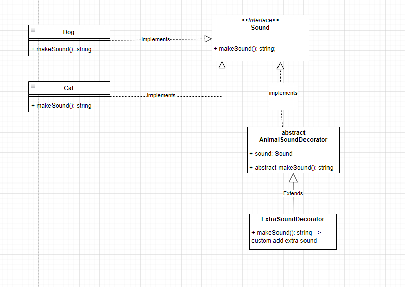

Diagram: 
Link diagram: https://drive.google.com/file/d/1FXqGYH35mgDSmTrFQ1zNTNLBjR2W79vl/view?usp=sharing

Cách thức xây dựng Decorator pattern:

-   các class con implements một interface --> bổ sung thêm một abstract base decorator implement interface đó và tạo ra 1 constructor có thể inject các instance của class con kia vào. Sau đó khi muốn viết thêm chức năng gì bổ sung vào các class con kia -> chỉ cần extend abstract base decorator và ghi đè phương thức(method) cũ của interface
    Tác dụng của decorator pattern:
-   tuân thủ O trong solid: Open/closed priciple: Thêm các behavior vào các class có sẵn mà không làm thay đổi code lúc đầu
